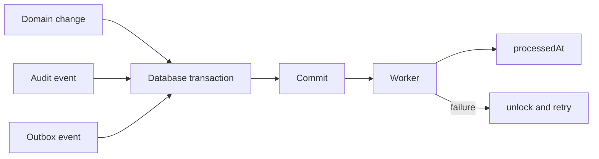

# Transactional outbox

Domain changes, audit records and `OutboxEvent` rows commit in one transaction. The worker claims pending rows with a conditional update, increments attempts, processes each event once, and records `processedAt`. Failures clear the lock and store a bounded error for retry.

## WhatsApp outbound

The reviewed sending lifecycle is stored separately in `OutboundDispatch`; processing its audit/outbox events never sends a message. A worker durably claims a dispatch before calling the provider and never automatically retries an unknown external outcome. See [Phase 10](phase-10-governed-outbound.md) for confirmation, governance revalidation and observed-message reconciliation.
